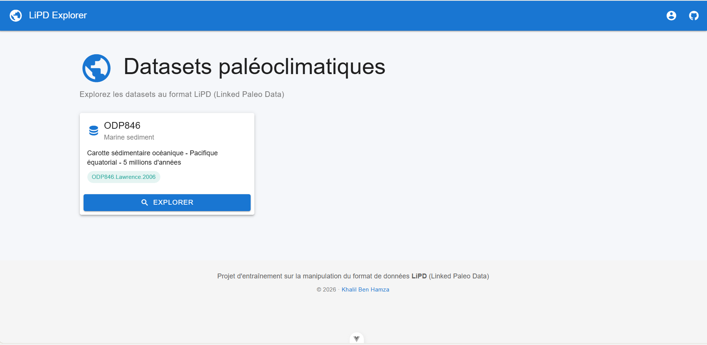
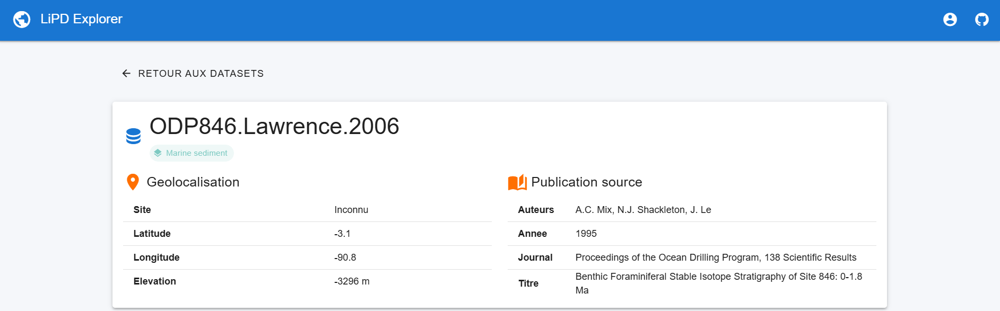
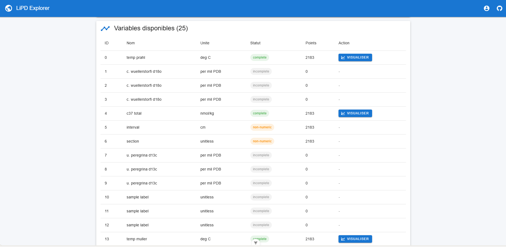
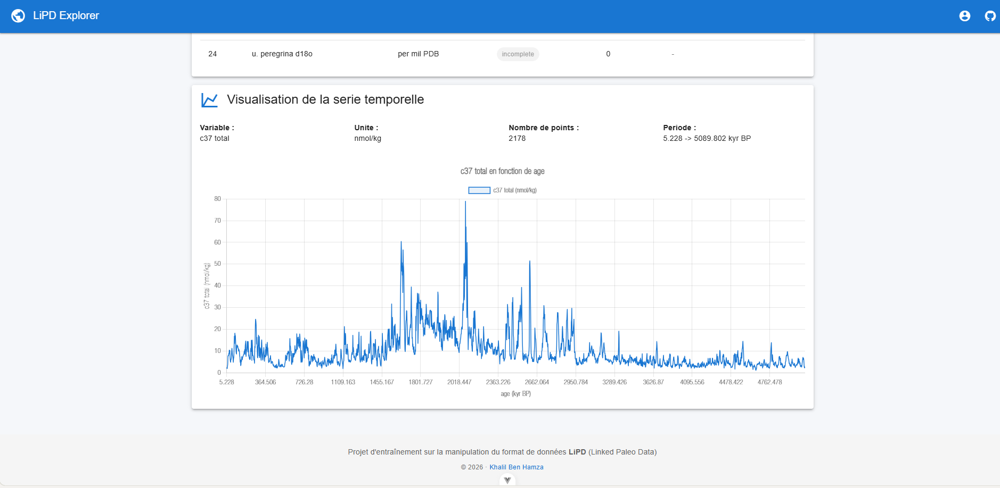

# LiPD Explorer

Application web fullstack pour explorer et visualiser des datasets paléoclimatiques
au format [Linked Paleo Data (LiPD)](https://lipd.net/), construite à des fins
d'apprentissage du format LiPD et de la stack technique utilisée à l'IPSL.

## Aperçu

### Page d'accueil — liste des datasets disponibles



### Page de détail — métadonnées et publication source



### Variables disponibles avec leur statut

Chaque variable est classée par statut (`complete`, `non-numeric`, `incomplete`).
Seules les variables `complete` peuvent être visualisées sous forme de graphique.



### Visualisation interactive d'une série temporelle

Exemple : reconstruction de la température de surface de l'océan (proxy `temp prahl`)
sur 5 millions d'années, mesurée sur la carotte ODP846.



## Contexte

Le format **LiPD** (Linked Paleo Data) est un standard de données utilisé par la
communauté internationale de paléoclimatologie pour stocker, partager et analyser
les enregistrements climatiques issus de proxies (carottes de glace, sédiments,
cernes d'arbres, coraux, pollen...).

Ce projet a été développé dans le cadre de la préparation à un entretien
d'alternance au [Centre de données ESPRI](https://espri.ipsl.fr/) de l'IPSL,
qui maintient notamment l'*IPSL Paleoclimate Database* et l'*African Pollen
Database* — deux applications web basées sur le format LiPD.

## Fonctionnalités

- Lecture de datasets LiPD via la librairie [PyLiPD](https://pylipd.readthedocs.io/)
- API REST exposant les métadonnées et séries temporelles d'un dataset
- Interface web pour parcourir les datasets disponibles
- Visualisation interactive des séries temporelles paléoclimatiques
- Gestion défensive des données scientifiques (valeurs `NaN`, types `numpy`,
  axes temporels manquants, variables non-numériques)

## Stack technique

| Couche       | Technologie                                                         |
|--------------|---------------------------------------------------------------------|
| Backend      | Python 3.12, Django 5, Django REST Framework, PyLiPD                |
| Frontend     | Vue 3 (Composition API), Vite, Vue Router 4, Vuetify 3, Axios       |
| Visualisation| Chart.js, vue-chartjs                                               |
| Outils       | Git, npm, pip, venv                                                 |

Ce choix de stack reproduit délibérément l'environnement technique d'ESPRI-OBS
(Django + Vue.js + Vuetify) afin de se familiariser avec leurs outils.

## Architecture

lipd-explorer/
├── backend/                 Projet Django
│   ├── backend/             Configuration (settings, urls, wsgi)
│   ├── api/                 App Django exposant l'API REST
│   │   ├── views.py         Vues HTTP (couche présentation)
│   │   ├── lipd_service.py  Logique métier (couche service PyLiPD)
│   │   └── urls.py          Routage des endpoints
│   └── manage.py
├── frontend/                Projet Vue 3 + Vite
│   └── src/
│       ├── views/           Pages (HomeView, DatasetDetail)
│       ├── components/      Composants réutilisables (TimeSeriesChart)
│       ├── services/        Client HTTP centralisé (api.js)
│       └── router/          Configuration Vue Router
├── exploration/             Scripts d'apprentissage du format LiPD
└── README.md


L'architecture suit une **séparation des responsabilités** :

- Les *vues* Django ne contiennent que de la logique HTTP (parsing de la requête,
  construction de la réponse, codes de statut).
- Le module `lipd_service.py` encapsule tous les appels à PyLiPD et la
  normalisation des données pour la sérialisation JSON.
- Côté frontend, le module `services/api.js` centralise les appels Axios pour
  garder les composants Vue concentrés sur l'affichage.

## API REST

| Méthode | Endpoint                                          | Description                                          |
|---------|---------------------------------------------------|------------------------------------------------------|
| `GET`   | `/`                                               | Liste les endpoints disponibles                      |
| `GET`   | `/api/datasets/`                                  | Liste des datasets exposés par l'application         |
| `GET`   | `/api/datasets/<name>/`                           | Métadonnées + variables d'un dataset                 |
| `GET`   | `/api/datasets/<name>/variables/<id>/`            | Data points (temps, valeur) d'une variable           |

Exemple de réponse pour `/api/datasets/ODP846/variables/5/` :

```json
{
  "variableId": 5,
  "variable": {
    "name": "temp prahl",
    "units": "deg C",
    "proxy": null
  },
  "timeAxis": {
    "name": "age",
    "units": "kyr BP"
  },
  "stats": {
    "totalPoints": 2183,
    "timeMin": 5.0,
    "timeMax": 5090.0,
    "valueMin": 17.84,
    "valueMax": 28.41
  },
  "dataPoints": [
    { "time": 5.0, "value": 25.41 },
    { "time": 7.0, "value": 25.78 }
  ]
}
```

## Choix d'implémentation notables

### Séparation des endpoints de métadonnées et de data points

L'endpoint `/api/datasets/<name>/` retourne uniquement la liste des variables
disponibles avec leur statut, sans les valeurs numériques. Les data points
(souvent plusieurs milliers par série) ne sont chargés qu'à la demande via
`/api/datasets/<name>/variables/<id>/`.

Ce découpage évite de transférer des dizaines de milliers de points lors du
premier affichage et améliore la réactivité de l'interface.

### Sérialisation défensive des données scientifiques

Les datasets paléoclimatiques contiennent fréquemment :

- des valeurs `NaN` (non-JSON-compliant par défaut),
- des types `numpy` (`int64`, `float64`, `ndarray`) non sérialisables nativement,
- des séries non datées (axe temporel `None`) ou non-numériques (codes de site).

Une fonction récursive `nettoyer_pour_json` parcourt la structure de réponse
et convertit ces cas en équivalents JSON valides (`null`, `int`, `float`, `list`).

### Catégorisation des variables par statut

Les variables sont classées en trois catégories renvoyées dans la réponse API :

- `complete` : axe temporel et valeurs numériques, prête à être visualisée,
- `non-numeric` : axe temporel présent mais valeurs textuelles (ex. identifiants
  de site, codes de méthode),
- `incomplete` : axe temporel manquant.

Le frontend n'active le bouton « Visualiser » que pour les variables `complete`.

## Installation locale

### Prérequis

- Python 3.10+
- Node.js 18+
- npm

### Backend

```bash
cd lipd-explorer
python -m venv venv

# Linux / macOS
source venv/bin/activate
# Windows (PowerShell)
.\venv\Scripts\activate

pip install pylipd django djangorestframework django-cors-headers numpy

cd backend
python manage.py migrate
python manage.py runserver
```

Le backend est disponible sur `http://localhost:8000`.

### Frontend

Dans un second terminal :

```bash
cd lipd-explorer/frontend
npm install
npm run dev
```

Le frontend est disponible sur `http://localhost:5173`.

## Dataset d'exemple

L'application charge par défaut le dataset `ODP846` embarqué dans PyLiPD :
une carotte sédimentaire forée à 3296 mètres de profondeur dans le Pacifique
équatorial est, à l'ouest des Galápagos, publiée par Lawrence et al. (2006)
dans *Science*, qui reconstitue l'évolution climatique sur 5 millions d'années
via plusieurs proxies (températures de surface, isotopes du carbone et de
l'oxygène).

> Lawrence, K. T., Liu, Z., & Herbert, T. D. (2006). *Evolution of the Eastern
> Tropical Pacific Through Plio-Pleistocene Glaciation*. Science, 312(5770),
> 79–83.

## Limitations connues

- Un seul dataset embarqué pour l'instant ; un endpoint d'upload de fichiers
  `.lpd` permettrait à un utilisateur de visualiser ses propres données.
- La carte géographique des sites de forage n'est pas encore implémentée.
- L'endpoint distant LiPDverse (`graphdb.mint.isi.edu`) est supporté par PyLiPD
  mais désactivé dans cette démo car les serveurs académiques peuvent être
  instables ou bloqués par certains pare-feux.

## Ressources

- [Site officiel LiPD](https://lipd.net/)
- [Documentation PyLiPD](https://pylipd.readthedocs.io/)
- [Ontologie LinkedEarth](https://wiki.linked.earth/)
- [LiPDverse](https://lipdverse.org/)
- McKay, N. P., & Emile-Geay, J. (2016). *Technical note: The Linked Paleo Data
  framework – a common tongue for paleoclimatology*. Climate of the Past, 12(4),
  1093–1100.

## Auteur

**Khalil Ben Hamza** — Étudiant en BUT Informatique, Université Paris-Saclay
[Portfolio](https://khalilbh2005.github.io/portfolio/) · [GitHub](https://github.com/khalilbh2005)